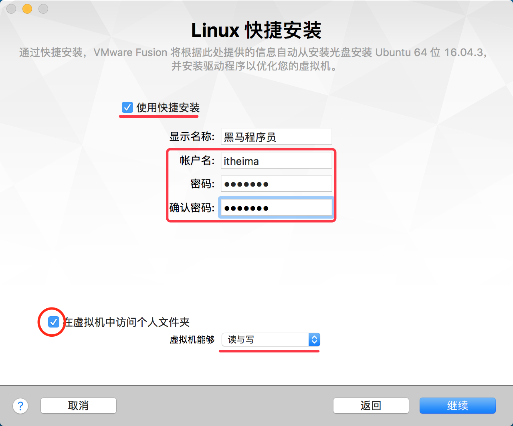
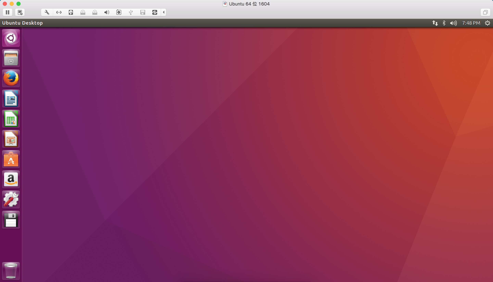
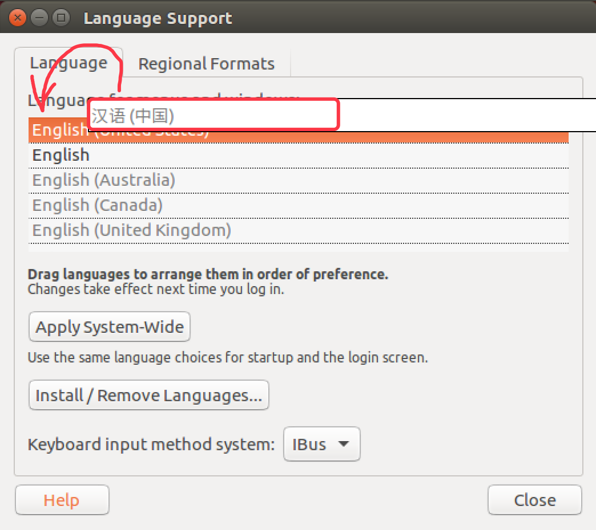
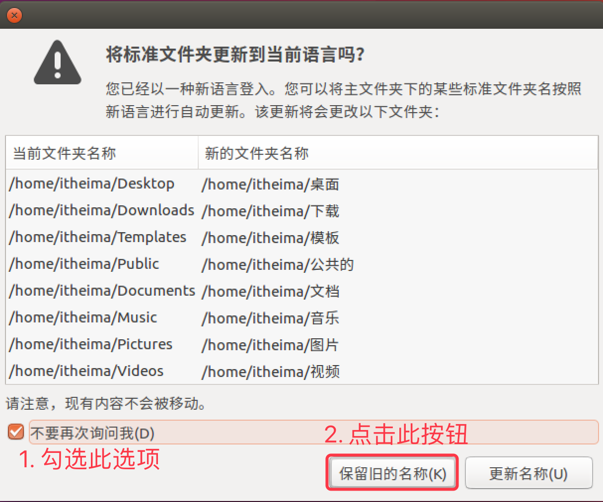
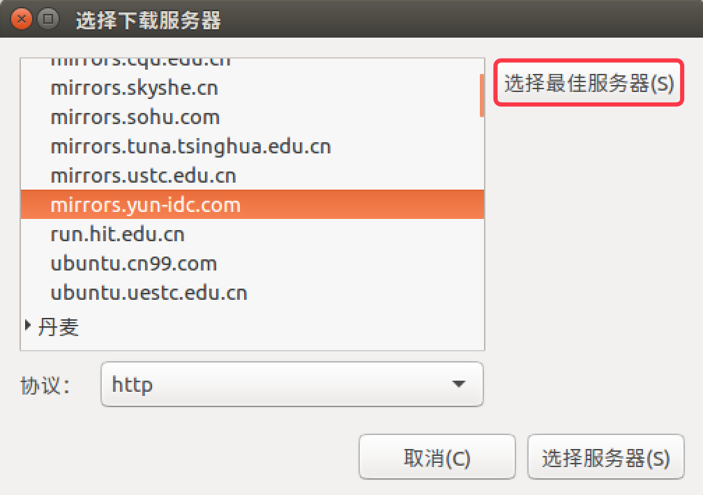

# 在虚拟机中安装 Ubuntu

## 步骤

1. 安装前的准备和基本安装
2. 设置语言环境
3. 安装常用软件

## 1. 安装前的准备和基本安装

### 1.1 安装前的准备

* 访问 http://cn.ubuntu.com/download/ 下载 Ubuntu 16.04 版本
* 在操作系统上安装 `VMWare` 虚拟机软件

### 1.2 基本安装

* 有了映像文件之后，只需要按照提示一步一步操作即可安装 Ubuntu 了
* **提示**，在开始安装之前，请确认勾选了 **在虚拟机中访问个人文件夹**，如下图所示：



> 该选项可以方便地实现在 **虚拟机** 和 **个人电脑** 之间共享文件

* 安装结束后，登录并且进入系统，可以看到以下画面：



## 2. 设置语言环境

按照以下步骤操作可以修改 ubuntu 的语言环境

* 1) 进入 **系统设置 System Settings**
* 2) 打开 **语言支持 Language Support**
* 3) 通过 **安装/删除语言 Install/Remove Languages** 添加 **简体中文 Chinese(simplified)**
* 4) 将 **汉语** 拖拽到 **顶部**，如下图所示：



* 5) **重新启动系统**
* 6) **不** 修改文件夹的名称，如下图所示：

 

## 3. 安装常用软件

* 3.1 设置服务器镜像源
* 3.2 在启动栏添加 **终端** 图标
* 3.3 **apt** 终端命令
* 3.4 谷歌浏览器 chrome
* 3.5 搜狗输入法

### 3.1 设置服务器镜像源

* Ubuntu 中 **大部分** 的软件 **安装/更新** 都是利用 `apt` 命令，从 **ubuntu 的服务器** 直接安装的
* Ubuntu **官方的服务器在国外**，为了提高软件 **安装/更新速度**，**ubuntu** 提供了 **选择最佳服务器** 的功能，可以帮助我们方便的找到一个速度最快的 **镜像服务器**！

> 所谓 **镜像服务器**，就是 **所有服务器的内容是相同的（镜像）**，但是根据所在位置不同，速度不同，通常国内服务器速度会更快一些！

按照以下步骤操作可以设置 ubuntu 的服务器

* 1) 进入 **系统设置**
* 2) 打开 **软件和更新**
* 3) 设置 **下载自...** **其他站点**
* 4) 通过 **选择最佳服务器** 选择速度最快的 **镜像源**，如下图所示：

 

**提示**：更换服务器之后，需要一个相对比较长时间的更新过程，需要耐心等待。更新完成后，再安装软件都会从新设置的服务器下载软件了

### 3.2 在启动栏添加 **终端** 图标

* Ubuntu 的 **启动栏** 类似于 Windows 的 **任务栏**，可以显示 **常用软件图标** 和 **正在运行的软件图标**
* 通常 Linux 的用户使用 **终端命令** 的频率非常高，所以会把 **终端** 添加到 **启动栏**
* 通过最上方的 **搜索** 按钮可以 **搜索并启动** 需要使用的程序
* **点击右键** 可以 **保留**、**删除** 或者 **移动** 启动栏中图标
* 可以把最常用的软件图标，**保留** 在启动栏，可以方便快速启动程序

### 3.3 apt 终端命令

* `apt` 是 `Advanced Packaging Tool`，是 Ubuntu 下的 **安装包管理工具**
* **大部分** 的软件 **安装/更新/卸载** 都是利用 `apt` 命令来实现的
* 直接在终端中输入 `apt` 即可以查阅命令的帮助信息
* 常用命令如下：

```bash
# 1. 安装软件
$ sudo apt install 软件名

# 2. 卸载软件
$ sudo apt remove 软件名

# 3. 更新可用软件包列表
$ sudo apt update

# 4. 更新已安装的包
$ sudo apt upgrade 
```

#### 1) 软件更新和升级

* 通常安装完 ubuntu 之后，可以先使用 `upgrade` 更新一下当前系统中可以升级的的软件包

```bash
$ sudo apt update

$ sudo apt upgrade
```

* **提示** 如果增加、更换了软件源，通常需要使用 `update` 更新一下本地缓存

#### 2) 安装常用工具

**提示** apt 安装命令的格式是不需要记忆的，如果在终端中输入的软件没有安装，系统会提示 **apt 命令** 的使用格式

##### python 程序员

```bash
$ sudo apt install ipython
$ sudo apt install ipython3
$ sudo apt install python-pip
$ sudo apt install python3-pip
```

##### C++ 程序员

```bash
$ sudo apt install cmake
$ sudo apt install qtcreator  
```

##### ruby 程序员

```bash
$ sudo apt install ruby
```

##### 安装 ssh 服务器

```bash
sudo apt install openssh-server
```

安装之后，才可以在其他系统中，通过 ssh 工具远程登陆

#### 3) 删除不使用的软件

**libreoffice**

* `libreoffice` 是一套类似于 `微软 Office` 的 **免费的** 办公套件
* 不过无论是界面交互还是执行性能都还有很大的提升空间
* 卸载 libreoffice 可以释放大概 **300M** 的磁盘空间

```bash
$ sudo apt remove libreoffice-common
```

**Amazon**

```bash
$ sudo apt remove unity-webapps-common
```

#### 4) 扩展：`apt` 和 `apt-get`

* `apt` 和 `apt-get` 都是 ubuntu 下常用的安装软件的命令
* **早期** 使用 `apt-get`，从 ununtu 16 开始，官方建议使用 `apt`
* 这两个命令的 **使用方式非常类似**

### 3.4 deb 安装格式

**deb** 是 Debian Linux 的安装格式，在 ubuntu 中同样可以使用。要安装 deb 安装包，需要使用 `dpkg` 这个终端命令，命令格式如下：

```bash
$ sudo dpkg -i <package.deb>
```

#### 1) 谷歌浏览器

1. 从 https://dl.google.com/linux/direct/google-chrome-stable_current_amd64.deb 下载最新版本的安装文件
2. 在终端中执行以下命令：

<!--sudo apt-get install libappindicator1 libindicator7 -->

```bash 
$ sudo apt install libappindicator1 libindicator7
$ sudo dpkg -i google-chrome-stable_current_amd64.deb   
$ sudo apt -f install 
```

#### 2) 搜狗输入法

**fcitx** 被称为 **小企鹅输入法**，是一个以 GPL 方式发布的 **输入法平台**，可以通过安装引擎支持多种输入法。它的优点是，短小精悍、跟程序的兼容性比较好！

1. 打开 **系统设置** **语言支持**
    * 将 **键盘输入法系统** 修改为 **fcitx**
2. 访问网站 http://pinyin.sogou.com/linux/ 下载最新版本的安装文件
3. 在终端中执行以下命令：

```bash

$ sudo dpkg -i sogoupinyin_2.1.0.0086_amd64.deb
$ sudo apt -f install 
```

> 提示，安装输入法之后，需要重新启动系统


